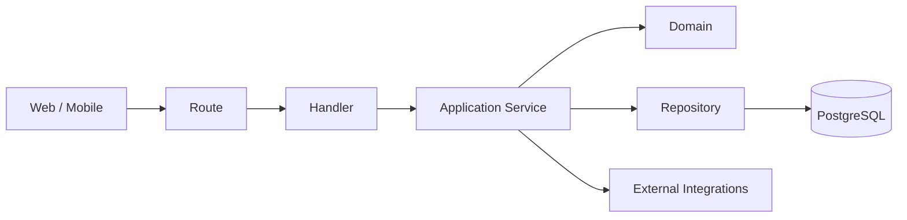

# sofortbot-backend

> Core API and business engine for Warehub/SofortBOT (Rust + Axum).

Backend is the system authority for rules, validation, normalization, and persistence.

---

## Contents

1. Overview
2. Architecture
3. API Contract
4. Local Development
5. Configuration
6. Quality Gates
7. Docker and Delivery
8. Operations Runbook

---

## 1. Overview

### Owns
- business logic and invariants
- transactional flows
- auth and permissions
- data persistence and migrations
- API v1 contract

### Never delegated to clients
- warehouse placement rules
- intake consistency checks
- canonical field normalization

---

## 2. Architecture



### Layer policy

| Layer | Responsibility | Forbidden |
|---|---|---|
| Route | URL mapping | business logic |
| Handler | parse/validate shape, map errors | rules/calculations |
| Service | use-case orchestration, transaction boundaries | raw transport concerns |
| Domain | invariants, core business decisions | DB/HTTP access |
| Repository | SQL and persistence | business decisions |

---

## 3. API Contract

- Base path: `/api/v1`
- OpenAPI: `/api/v1/openapi.json`
- Scalar UI: `/api/v1/scalar`
- Meta: `/api/v1/meta`
- Mobile update: `/api/v1/mobile/app-update`
- Health: `/api/v1/healthz`
- Ready: `/api/v1/readyz`

### Error envelope

```json
{
  "code": "ERROR_CODE",
  "message": "Human readable message",
  "request_id": "uuid",
  "details": {}
}
```

---

## 4. Local Development

```bash
cargo run
```

Default port: `8932` (`APP_PORT` overrides).

---

## 5. Configuration

### Core runtime
- `APP_ENV=dev|stage|prod`
- `APP_PORT=8932`
- `DATABASE_URL=postgres://...`
- `AUTH_TOKEN_TTL_HOURS=24`
- `CORS_ALLOW_ORIGINS=https://...`

### Upload storage
- `UPLOAD_STORAGE_BACKEND=local|ftp`
- `UPLOAD_FTP_HOST`
- `UPLOAD_FTP_USER`
- `UPLOAD_FTP_PASS`
- `UPLOAD_FTP_PORT=21`
- `UPLOAD_FTP_ROOT_DIR=warehub`
- `UPLOAD_FTP_STORAGE_ROOT_DIR=warehub`
- `UPLOAD_FTP_AVATAR_DIR=avatar`
- `UPLOAD_FTP_PUBLIC_BASE_URL=https://media.../warehub`

### Mobile update metadata
- `MOBILE_STAGE_APP_VERSION=vX.Y.Z`
- `MOBILE_STAGE_APK_URL=https://.../warehubstage.apk`
- `MOBILE_PROD_APP_VERSION=vX.Y.Z`
- `MOBILE_PROD_APK_URL=https://.../warehub.apk`

### Observability
- `SENTRY_DSN`
- `SENTRY_TRACES_SAMPLE_RATE=0.1`

---

## 6. Quality Gates

```bash
cargo fmt --all -- --check
cargo clippy -- -D warnings
cargo test
```

---

## 7. Docker and Delivery

```bash
docker build --target dev -t sofortbot-backend:dev .
docker build --target stage -t sofortbot-backend:stage .
docker build --target prod -t sofortbot-backend:prod .
```

Delivery model:
- this repo builds and publishes images
- rollout to servers is handled by `sofortbot-infra`

---

## 8. Operations Runbook

### 401 on protected endpoints
- verify `Authorization: Bearer <token>`
- verify token TTL and approval status

### Upload URL exists but file not accessible
- verify FTP runtime env inside backend container
- verify `UPLOAD_FTP_STORAGE_ROOT_DIR` path mapping
- verify public media domain and TLS

### Mobile endless update prompt
- compare APK `versionName` and backend `MOBILE_*_APP_VERSION`
