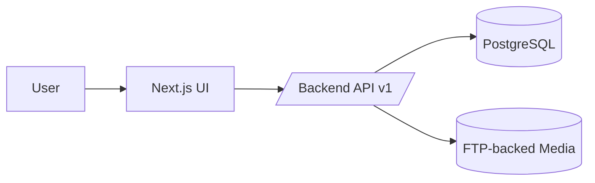

# sofortbot-frontend

> Next.js control panel for Warehub/SofortBOT.

Frontend is intentionally thin: render, orchestrate UI state, and consume backend contracts.

---

## Contents

1. Overview
2. Runtime Model
3. Configuration
4. Quality Gates
5. Delivery
6. Troubleshooting

---

## 1. Overview

### Responsibilities
- dashboard and operational UI
- request/response wiring to API v1
- visual grouping, filtering, navigation
- user session handling in browser

### Non-responsibilities
- core placement logic
- authoritative validation
- domain invariants

---

## 2. Runtime Model



Auth/session:
- access token kept in browser memory
- refresh token stored in HttpOnly `sofortbot_refresh_token` cookie
- unauthorized responses should trigger refresh or redirect to login

---

## 3. Configuration

### Core
- `NEXT_PUBLIC_API_BASE_URL=http://localhost:8932/api/v1`
- `NEXT_PUBLIC_ANDROID_APK_URL=https://.../warehub.apk` (generic fallback)
- `NEXT_PUBLIC_ANDROID_APK_URL_STAGE=https://.../warehub-stage.apk`
- `NEXT_PUBLIC_ANDROID_APK_URL_PROD=https://.../warehub.apk`
- `NEXT_PUBLIC_APP_ENV=stage|production`
- `NEXT_PUBLIC_APP_VERSION=vX.Y.Z`

### Sentry (browser)
- `NEXT_PUBLIC_SENTRY_DSN`
- `NEXT_PUBLIC_SENTRY_TRACES_SAMPLE_RATE=0.1`
- `NEXT_PUBLIC_SENTRY_REPLAYS_ON_ERROR_SAMPLE_RATE=1.0`
- `NEXT_PUBLIC_SENTRY_REPLAYS_SESSION_SAMPLE_RATE=0.0`

### Sentry (server/edge)
- `SENTRY_DSN`
- `SENTRY_TRACES_SAMPLE_RATE=0.1`
- `APP_ENV=stage|production`
- `APP_VERSION=vX.Y.Z`

### Sourcemaps in CI
- `SENTRY_ORG`
- `SENTRY_PROJECT`
- `SENTRY_AUTH_TOKEN`

---

## 4. Quality Gates

```bash
npm ci
npm run lint
npm run typecheck
npm test
npm run perf:check
npm run openapi:generate
```

Local start:

```bash
npm run dev
```

Default port: `8931`.

Visual baseline workflow:

```bash
# run snapshot assertions
E2E_VISUAL=1 npm run test:e2e:visual

# (re)generate baseline snapshots intentionally
E2E_VISUAL=1 npm run test:e2e:visual:update
```

Snapshots are stored under `e2e/__screenshots__/...`.

E2E suite split:

```bash
npm run test:e2e:smoke
npm run test:e2e:table
npm run test:e2e:flaky
npm run test:e2e:visual
npm run test:e2e:mutation
npm run test:e2e:perf
```

`test:e2e:smoke` and `test:e2e:table` run `e2e:preflight` first (checks credentials + frontend/backend reachability).
`test:e2e:flaky` runs only tests tagged with `@flaky` using a dedicated Playwright project (`chromium-flaky`) with higher timeout/retries.

Storybook:

```bash
npm run storybook
# build static storybook
npm run build-storybook
```

E2E credentials (local):

- Fill `E2E_LOGIN` and `E2E_PASSWORD` in `.env.example`-based local env.
- Or set them directly in PowerShell:

```powershell
$env:E2E_LOGIN="your_login"
$env:E2E_PASSWORD="your_password"
npm run test:e2e:smoke
```

E2E without auth backend (mock-mode):

- Set `E2E_BYPASS_AUTH=1` to bypass login flow and inject a test refresh cookie.
- Use this for mocked orchestrator/UI contract tests when auth service is not ready.

```powershell
$env:E2E_BYPASS_AUTH="1"
npm run test:e2e:orchestrator-mocks
```

Visual baseline details:

- `docs/FRONTEND_VISUAL_BASELINE.md`
- `docs/FRONTEND_VISUAL_QA_CHECKLIST.md`
- E2E debugging runbook: `docs/FRONTEND_E2E_DEBUGGING.md`
- E2E tagging policy: `docs/FRONTEND_E2E_TAGGING_POLICY.md`

OpenAPI typed client baseline:

```bash
# fetch unified schema from local frontend proxy route
npm run openapi:pull

# generate types from saved schema
npm run openapi:types

# one-shot
npm run openapi:generate

# verify generated types are in sync with committed schema
npm run openapi:check

# generate dedicated orchestrator client types from orchestrator baseline schema
npm run openapi:orchestrator:types

# verify orchestrator generated types are in sync
npm run openapi:orchestrator:check
```

---

## 5. Delivery

- `CI (Frontend)` on `push` and `pull_request` to `main`:
  - quality gates: lint, typecheck, unit tests, build, perf budget
  - e2e smoke: runs when `E2E_LOGIN` and `E2E_PASSWORD` are present in repository secrets
  - visual regression: runs when `E2E_LOGIN`/`E2E_PASSWORD` are present and repository variable `E2E_VISUAL=1`
- `CD Stage` on `main`
- `CD Prod` on `vX.Y.Z`

Image tags:
- stage: `stage-<sha>`, `stage-latest`
- prod: `vX.Y.Z`, `prod-latest`

Deployment to hosts is managed by `sofortbot-infra`.

---

## 6. Troubleshooting

### Websocket reconnect loop
- verify `/api/v1/intakes/ws` is reachable through proxy
- verify auth bootstrap can refresh access token
- verify nginx websocket headers

### 401 on logs or API requests
- access token expired, refresh cookie missing, or refresh session revoked
- retest `/api/v1/auth/refresh` and `/api/v1/auth/me`

### Product photos not visible
- check `photo_url` payload from backend
- ensure media domain is public and HTTPS
- avoid mixed-content (`https` app + `http` media)

---

## Observability

- Sentry UI telemetry dashboard/runbook:
  - `docs/FRONTEND_OBSERVABILITY.md`

