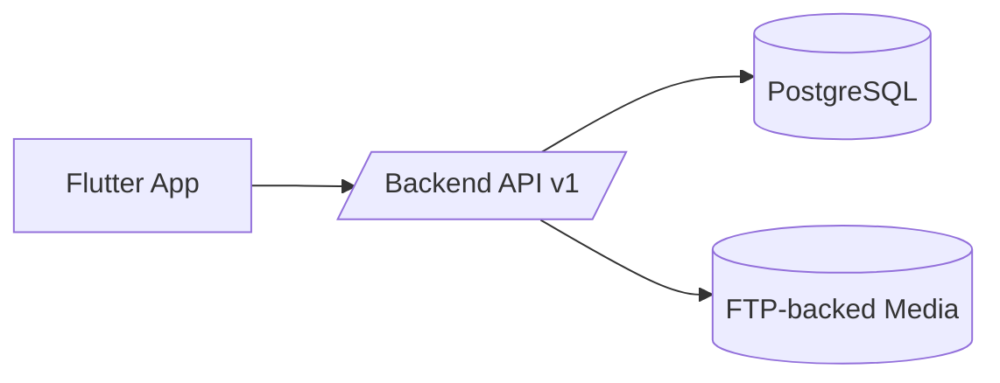

# sofortbot-mobile

> Flutter operational client for Warehub/SofortBOT.

Designed as a thin client for warehouse operations: scan, capture, submit, sync.

---

## Contents

1. Overview
2. Flavors and Identity
3. Local Development
4. Update Pipeline
5. CI/CD
6. Troubleshooting

---

## 1. Overview



### Responsibilities
- authentication UX
- scan/add/remove flows
- photo capture and upload
- realtime sync via websocket
- update prompt via backend metadata

### Non-responsibilities
- placement business logic
- canonical validation rules

---

## 2. Flavors and Identity

| Flavor | App Name | Package Suffix | Purpose |
|---|---|---|---|
| `dev` | `warehubdev` | `.dev` | local/dev testing |
| `stage` | `warehubstage` | `.stage` | pre-production verification |
| `prod` | `warehub` | none | production |

---

## 3. Local Development

Install dependencies:

```bash
flutter pub get
```

Run dev flavor against local LAN backend:

```bash
flutter run --flavor dev --dart-define=APP_ENV=dev
```

Optional Sentry runtime defines:

```bash
flutter run --flavor stage \
  --dart-define=API_BASE_URL=https://stage.example.com/api/v1 \
  --dart-define=SENTRY_DSN=https://<key>@<host>/<project> \
  --dart-define=APP_ENV=stage \
  --dart-define=SENTRY_TRACES_SAMPLE_RATE=0.1 \
  --dart-define=SENTRY_SEND_DEFAULT_PII=false
```

Quality gates:

```bash
dart format --set-exit-if-changed lib test
flutter analyze
flutter test
```

---

## 4. Update Pipeline

App checks:
- `GET /api/v1/mobile/app-update`

Payload fields:
- `channel`
- `latest_version`
- `apk_url`

Critical rule:
- `latest_version` must match installed APK `versionName`, otherwise users get endless update prompts.

---

## 5. CI/CD

- `CI (Dev)` on `push` and `pull_request` to `main`
- `CD Stage` on `main`
- `CD Prod` on semantic tags `vX.Y.Z`

Stage APK deployment behavior:
- deploys `warehubstage.apk`
- creates versioned copy `warehubstage-<version>.apk`
- keeps only 2 latest versioned stage APKs

Prod APK deployment behavior:
- deploys `warehub.apk`

### Required secrets

Stage:
- `STAGE_API_BASE_URL`
- `STAGE_SENTRY_DSN`
- `STAGE_SSH_HOST`
- `STAGE_SSH_USER`
- `STAGE_SSH_KEY`
- `APK_DEPLOY_PATH`

Prod:
- `PROD_API_BASE_URL`
- `PROD_SENTRY_DSN`
- `PROD_SSH_HOST`
- `PROD_SSH_USER`
- `PROD_SSH_KEY`
- `APK_DEPLOY_PATH`

Shared optional:
- `SENTRY_TRACES_SAMPLE_RATE`
- `SENTRY_SEND_DEFAULT_PII`

---

## 6. Troubleshooting

### Endless update popup
- check backend response from `/api/v1/mobile/app-update`
- ensure `latest_version` equals APK `versionName`

### 401 in app actions
- token missing/expired
- force relogin and recheck auth headers

### Photos uploaded but not shown
- check returned `photo_url`
- verify media domain availability and HTTPS
