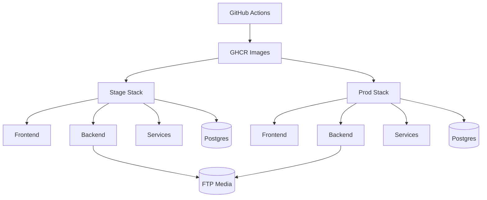

# sofortbot-infra

> Deployment and operations control plane for Warehub/SofortBOT.

Application repositories publish images. This repository wires environments and performs rollouts.

---

## Contents

1. Infrastructure Topology
2. Repository Structure
3. Environment Contract
4. Deployment Commands
5. Release Strategy
6. Validation and Runbook

---

## 1. Infrastructure Topology



---

## 2. Repository Structure

- `local/docker-compose.dev.yml` local dependencies
- `deploy/stage/docker-compose.yml` stage stack
- `deploy/prod/docker-compose.yml` production stack
- `deploy/runners/install-12-runners.sh` one-command setup for 12 shared gitea actions runners
- `deploy/nginx/sofortbot.conf.template` reverse-proxy template
- `scripts/release-stage.sh` stage release helper
- `scripts/release-prod.sh` prod release helper
- `scripts/release-infra.sh` generic release helper
- `scripts/enqueue-deploy.sh` deploy request enqueue helper
- `scripts/deploy-watcher.sh` server-side deploy watcher
- `up-stage.sh` one-command stage rollout
- `up-prod.sh` one-command prod rollout
- `OPS_HEALTH_VERIFICATION.md` local infra/ops health wiring checklist
- `scripts/verify-stage-migration-plan.ps1` stage migration-plan dry verification helper (no apply)
- `scripts/verify-prod-migration-plan.ps1` prod migration-plan dry verification helper (no apply)
- `scripts/verify-all-migration-plans.ps1` wrapper that runs stage+prod migration-plan dry checks and writes combined summary
- `scripts/verify-remote-migration-plans.ps1` remote stage+prod migration-plan dry checks over SSH (for server-hosted environments)
- `scripts/verify-required-env.ps1` preflight env key validation for stage/prod infra checks
- `REQUEST_ID_PROPAGATION_CHECKLIST.md` end-to-end request id propagation verification
- `docs/security/SECRETS_RUNTIME_LOCATIONS.md` runtime source-of-truth for dev/stage/prod secrets
- `docs/security/ROTATION_EXECUTION_TEMPLATE.md` execution template for secret rotation batches
- `docs/security/ROTATION_LOG_2026-05.md` monthly execution log for completed rotation batches
- `docs/MVP_LAUNCH_READINESS_CHECKLIST.md` final launch go/no-go checklist with linked evidence
- `docs/ROADMAP_CLOSEOUT_2026-05-20.md` roadmap closeout state with remaining manual GO/NO-GO blockers
- `docs/STAGE_SMOKE_SIGNOFF_TEMPLATE.md` stage validation sign-off template
- `docs/ROLLBACK_DRILL_SIGNOFF_TEMPLATE.md` rollback drill sign-off template
- `docs/MVP_GO_NO_GO_APPROVAL_TEMPLATE.md` final business/tech/ops launch approval template
- `scripts/prepare-launch-signoff-pack.ps1` generate dated launch sign-off document pack from templates
- `deploy/systemd/sofortbot-deploy-watcher.service` watcher unit
- `versions.env` tracked release markers
- `.env.example` required env template
- `bd/dev`, `bd/stage`, `bd/prod` postgres data roots per environment

---

## 3. Environment Contract

Server `.env` is runtime truth.
Do not commit secrets.

### Required runtime groups

API URLs:
- `STAGE_PUBLIC_API_BASE_URL=https://stagewarehub.automatonsoft.de/api/v1`
- `PROD_PUBLIC_API_BASE_URL=https://warehub.automatonsoft.de/api/v1`
- `STAGE_PUBLIC_SERVICES_API_BASE_URL`
- `PROD_PUBLIC_SERVICES_API_BASE_URL`
- `STAGE_PUBLIC_ORCHESTRATOR_API_BASE_URL`
- `PROD_PUBLIC_ORCHESTRATOR_API_BASE_URL`

Stage image tags:
- `BACKEND_STAGE_TAG`
- `FRONTEND_STAGE_TAG`
- `MOBILE_STAGE_TAG`
- `SERVICES_STAGE_TAG`

Prod image versions:
- `BACKEND_APP_VERSION`
- `FRONTEND_APP_VERSION`
- `MOBILE_APP_VERSION`
- `SERVICES_APP_VERSION`
- `ORCHESTRATOR_APP_VERSION`

Orchestrator internal wiring:
- `STAGE_ORCHESTRATOR_DATABASE_SERVICE_BASE_URL` (default `http://services:8000`)
- `PROD_ORCHESTRATOR_DATABASE_SERVICE_BASE_URL` (default `http://services:8000`)
- `ORCHESTRATOR_HTTP_TIMEOUT_SECONDS`
- `ORCHESTRATOR_HTTP_RETRIES`
- `ORCHESTRATOR_IDEMPOTENCY_TTL_SECONDS`
- `ORCHESTRATOR_SERVICE_NAME`
- `ORCHESTRATOR_LOG_LEVEL`

Mobile update metadata:
- `MOBILE_STAGE_APP_VERSION`
- `MOBILE_STAGE_APK_URL`
- `MOBILE_PROD_APP_VERSION`
- `MOBILE_PROD_APK_URL`

FTP media config for backend:
- `BACKEND_UPLOAD_STORAGE_BACKEND=ftp`
- `BACKEND_UPLOAD_FTP_HOST`
- `BACKEND_UPLOAD_FTP_USER`
- `BACKEND_UPLOAD_FTP_PASS`
- `BACKEND_UPLOAD_FTP_PORT=21`
- `BACKEND_UPLOAD_FTP_ROOT_DIR=warehub`
- `BACKEND_UPLOAD_FTP_STORAGE_ROOT_DIR=warehub`
- `BACKEND_UPLOAD_FTP_AVATAR_DIR=avatar`
- `BACKEND_STAGE_UPLOAD_FTP_PUBLIC_BASE_URL`
- `BACKEND_PROD_UPLOAD_FTP_PUBLIC_BASE_URL`

Sentry backend:
- `BACKEND_STAGE_SENTRY_DSN`
- `BACKEND_STAGE_SENTRY_TRACES_SAMPLE_RATE`
- `BACKEND_PROD_SENTRY_DSN`
- `BACKEND_PROD_SENTRY_TRACES_SAMPLE_RATE`

---

## 4. Deployment Commands

Stage:

```bash
./up-stage.sh
```

Prod:

```bash
./up-prod.sh
```

Generic helper:

```bash
./scripts/release-infra.sh --env stage --remove-orphans
./scripts/release-infra.sh --env prod --remove-orphans
```

Queue a deploy request (watcher mode):

```bash
./scripts/enqueue-deploy.sh --env stage --version v0.4.4-stage.7
./scripts/enqueue-deploy.sh --env prod --version v0.4.5
```

---

## 5. Release Strategy

### Stage
- moves fast with stage tags
- validates business flow, updates, media, websockets

### Prod
- pinned semantic versions only
- rollout after stage validation

Tracked release markers:
- `versions.env` (`STAGE_VERSION`, `PROD_VERSION`)

---

## 6. Validation and Runbook

Check stack status:

```bash
docker compose -f deploy/stage/docker-compose.yml --env-file .env ps
docker compose -f deploy/prod/docker-compose.yml --env-file .env ps
```

Stage deploy behavior:

- `stage-deploy.yml` applies Django migrations automatically during the `stage` pipeline after pulling images and before the application services are promoted.
- `RUN_MIGRATIONS_ON_STARTUP` remains gated to avoid implicit migrations on ordinary container restarts.
- Production migrations remain manual and require explicit approval.

Remote migration-plan verification (stage+prod on server):

```powershell
powershell -ExecutionPolicy Bypass -File scripts/verify-remote-migration-plans.ps1 `
  -ServerHost <SERVER_HOST> `
  -User <SERVER_USER> `
  -RemoteRepoPath /opt/sofortbot-infra `
  -RemoteEnvFile .env
```

Reports are always saved under `sofortbot-infra/docs/remote-migration-verification` by default, regardless of current shell working directory.

If the main remote path is unknown, pass candidates:

```powershell
powershell -ExecutionPolicy Bypass -File scripts/verify-remote-migration-plans.ps1 `
  -ServerHost <SERVER_HOST> `
  -User <SERVER_USER> `
  -RemoteRepoPathCandidates /opt/sofortbot-infra,/home/deploy/sofortbot-infra,~/sofortbot-infra `
  -RemoteEnvFile .env
```

Secret scan (gitleaks-first, fallback regex if gitleaks is unavailable):

```powershell
powershell -ExecutionPolicy Bypass -File scripts/scan-secrets.ps1 -TargetPath .. 
```

Validate `.env.example` placeholder-only policy for sensitive keys:

```powershell
powershell -ExecutionPolicy Bypass -File scripts/verify-env-example-placeholders.ps1
```

Verify runtime `.env` is not tracked by git:

```powershell
powershell -ExecutionPolicy Bypass -File scripts/verify-env-tracking.ps1 -RepoPath .
```

Run all security checks in one command:

```powershell
powershell -ExecutionPolicy Bypass -File scripts/security-preflight.ps1 -RepoPath .
```

Run infra ops preflight (env + migration checks):

```powershell
powershell -ExecutionPolicy Bypass -File scripts/ops-preflight.ps1 -RepoPath .
```

Run infra ops preflight in remote mode (server-hosted stage/prod):

```powershell
powershell -ExecutionPolicy Bypass -File scripts/ops-preflight.ps1 `
  -RepoPath . `
  -UseRemote `
  -ServerHost <SERVER_HOST> `
  -ServerUser <SERVER_USER> `
  -SshPort 22 `
  -RemoteRepoPath /home/server/sofotbot/infra `
  -RemoteEnvFile .env
```

Run API contract preflight across frontend/services/orchestrator:

```powershell
powershell -ExecutionPolicy Bypass -File scripts/api-contract-preflight.ps1 -WorkspaceRoot .. -Mode quick
```

Strict mode (fail if any step is skipped):

```powershell
powershell -ExecutionPolicy Bypass -File scripts/api-contract-preflight.ps1 -Mode quick -FailOnSkip
```

Strict mode with explicit skip allow-list:

```powershell
powershell -ExecutionPolicy Bypass -File scripts/api-contract-preflight.ps1 `
  -Mode quick `
  -FailOnSkip `
  -SkipAllowList database-makemigrations-check,database-migrate-plan
```

Run unified quality gate (security + ops + api-contract):

```powershell
powershell -ExecutionPolicy Bypass -File scripts/quality-gate.ps1 -RepoPath . -ApiStrict
```

Remote ops mode:

```powershell
powershell -ExecutionPolicy Bypass -File scripts/quality-gate.ps1 `
  -RepoPath . `
  -OpsMode remote `
  -ServerHost <SERVER_HOST> `
  -ServerUser <SERVER_USER> `
  -SshPort 22 `
  -RemoteRepoPath /home/server/sofotbot/infra `
  -RemoteEnvFile .env `
  -ApiStrict
```

Prepare dated launch sign-off pack:

```powershell
powershell -ExecutionPolicy Bypass -File scripts/prepare-launch-signoff-pack.ps1 -RepoPath .
```

Check backend env wiring in stage:

```bash
docker compose -f deploy/stage/docker-compose.yml --env-file .env exec backend printenv | grep -E "UPLOAD_FTP|MOBILE_STAGE_APP_VERSION|SENTRY"
```

Check mobile update metadata:

```bash
curl -s https://stagewarehub.automatonsoft.de/api/v1/mobile/app-update
curl -s https://warehub.automatonsoft.de/api/v1/mobile/app-update
```

### Incident quick map

Endless update prompt:
- mismatch between APK `versionName` and backend `MOBILE_*_APP_VERSION`

Images not visible:
- FTP root/public URL mismatch
- missing TLS/public route for media domain

Websocket flapping:
- proxy websocket headers not configured
- expired token

Frontend 401 flood:
- invalid/expired session token
- broken auth propagation

Deploy not triggering in watcher mode:
- check watcher service status (`systemctl status sofortbot-deploy-watcher`)
- check request queue files (`.deploy-requests/stage.request`, `.deploy-requests/prod.request`)
- verify required image tags exist in registry (`backend/frontend/mobile/services` for requested version)

---

## 7. Shared Dev Postgres (Dedicated server, example values)

Use this when multiple developers need one common database in local development.

1. Use one source of truth for all repositories:

- `sofortbot-infra/.env`

2. Set shared DB values in `sofortbot-infra/.env` (use your own credentials):

```env
DATABASE_URL=postgres://<DB_USER>:<DB_PASSWORD>@<DB_HOST>:15432/sofortbot_shared_dev
DEV_POSTGRES_HOST=<DB_HOST>
DEV_POSTGRES_HOST_PORT=15432
DEV_POSTGRES_DB=sofortbot_shared_dev
DEV_POSTGRES_USER=<DB_USER>
DEV_POSTGRES_PASSWORD=<DB_PASSWORD>
```

3. Start local stack as usual (`start-dev.ps1`).
   - If `DEV_POSTGRES_HOST` is not `postgres`, local postgres container is skipped.
   - Backend, frontend and services read `sofortbot-infra/.env` automatically.

4. Provision database on server (`<DB_HOST>`) once:

```bash
apt-get update
apt-get install -y docker.io
systemctl enable --now docker

docker volume create sofortbot-pg-data

docker run -d \
  --name sofortbot-shared-pg \
  --restart unless-stopped \
  -e POSTGRES_DB=sofortbot_shared_dev \
  -e POSTGRES_USER=<DB_USER> \
  -e POSTGRES_PASSWORD='<DB_PASSWORD>' \
  -v sofortbot-pg-data:/var/lib/postgresql/data \
  -p 15432:5432 \
  postgres:16-alpine
```

5. Open firewall only for trusted developer IPs on `15432/tcp` (no SSH tunnel):

```bash
ufw allow from <DEV_IP_1> to any port 15432 proto tcp
ufw allow from <DEV_IP_2> to any port 15432 proto tcp
ufw status
```

Note:
- Keep `80/443` for nginx, DB runs on dedicated `15432`.
- This setup is for development only; do not use it in production.


